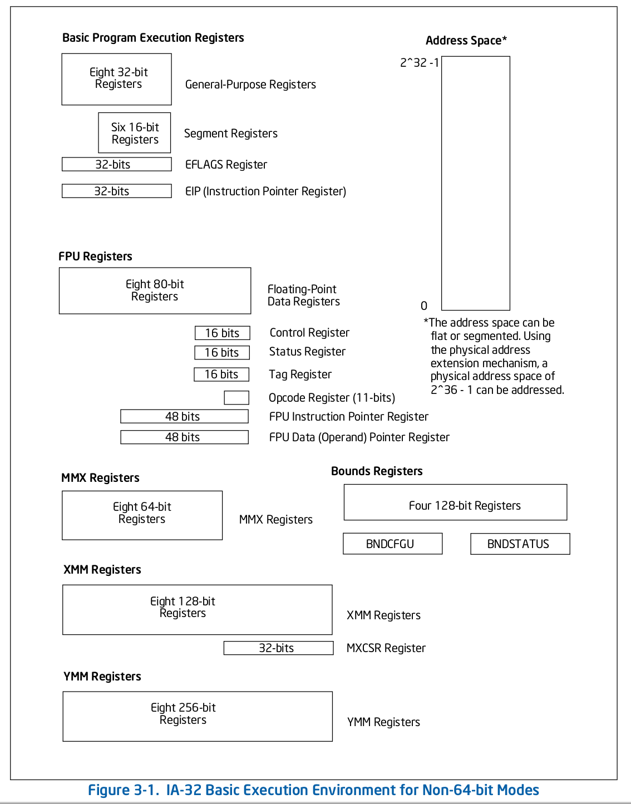

# Задание

Ассемблерные коды всех программ будут разбираться в синтаксисе **Intel** при сборке с помощью gcc. Можно заметить, что коды всех программ разделены на секции (**.init**, **.plt**, **.text** и **.fini**), краткое описание которых можно найти [здесь](https://refspecs.linuxbase.org/LSB_3.1.1/LSB-Core-generic/LSB-Core-generic/specialsections.html). Конкретно в данном разделе меня будет интересовать секция **.text**, так как именно в ней находится часть с кодом.



### <p style="text-align: center;">Запуск функций с различным числом параметров</p>

### 64-x битный режим

В дизасемблере 64-х битного режима в метке **_start** происходит запись эффективного адреса **[rip+0x2a2]** метки **main** в регистр **rdi**. 
В начале кода функции **main** происходит вызов инструкции **endbr64**, который необходим для корректного завершения indirect перехода между метками (see **Volume 2, Chapter 3, 3.3 Instructions (A-L)**):
```
0000000000001321 <main>:
    1321:	f3 0f 1e fa          	endbr64 
```
После идет пролог функции, в котором происходит запись старого значения **base pointer** в стек, после чего указатель стека копируется базу. После этих иструкций **rbp** указывает на базовый сегмент стекового фрейма **main**:
```
    1325:	55                   	push   rbp
    1326:	48 89 e5             	mov    rbp,rsp
```
Далее идет движение по стековому фрейму инструкцией с последующей записью 0 в регистр **eax** в качестве возвращаемого значения по умолчанию при выходе из **main**:
```
    1329:	48 83 ec 10          	sub    rsp,0x10
    132d:	89 f8                	mov    eax,edi
    132f:	48 89 75 f0          	mov    QWORD PTR [rbp-0x10],rsi
    1333:	88 45 fc             	mov    BYTE PTR [rbp-0x4],al
    1336:	b8 00 00 00 00       	mov    eax,0x0
```
Потом происходят вызовы функций с помощью **call** по меткам с записью аргументов в регистры **edi, esi, edx, ecx, r8d, r9d** в данном порядке по мере необходимости при вызове функций до 6 аргументов. Дальше аргументы кладутся в стек с перемещением его верхушки (пример для вызова **func7**):
```
    13ca:	48 83 ec 08          	sub    rsp,0x8
    13ce:	6a 07                	push   0x7
    13d0:	41 b9 06 00 00 00    	mov    r9d,0x6
    13d6:	41 b8 05 00 00 00    	mov    r8d,0x5
    13dc:	b9 04 00 00 00       	mov    ecx,0x4
    13e1:	ba 03 00 00 00       	mov    edx,0x3
    13e6:	be 02 00 00 00       	mov    esi,0x2
    13eb:	bf 01 00 00 00       	mov    edi,0x1
    13f0:	e8 64 fe ff ff       	call   1259 <func7>
```
В начале кода каждой функции **func** идут знакомые вызовы **endbr64** с изменением указателя базового сегмента на стек функции.
```
    1149:	f3 0f 1e fa          	endbr64 
    114d:	55                   	push   rbp
    114e:	48 89 e5             	mov    rbp,rsp
```
После происходит копирование значений из регистров в стековый фрейм функции с необходимым изменением адреса верхушки стека, соответствующим образу выше (при этом после 6 аргументов не происходит **pop** оставшихся аргментов). Затем происходит запись адреса константного строкового объекта (через **rip**) в регистр **rax**:
```
0000000000001163 <func1>:
    1163:	f3 0f 1e fa          	endbr64 
    1167:	55                   	push   rbp
    1168:	48 89 e5             	mov    rbp,rsp
    116b:	48 83 ec 10          	sub    rsp,0x10
    116f:	89 7d fc             	mov    DWORD PTR [rbp-0x4],edi
    1172:	48 8d 05 b7 0e 00 00 	lea    rax,[rip+0xeb7]        # 2030 <_IO_stdin_used+0x30>
    1179:	48 89 c7             	mov    rdi,rax
```
После чего происходит вызов **printf** из динамически слинкованной стандартной библиотеки по специальной метке. Затем следуют инструкции **nop** (смысл которого я до сих пор не особо осознал), **leave** для очистки стека функции и **ret** для выхода из функции:
```
    117c:	e8 cf fe ff ff       	call   1050 <puts@plt>
    1181:	90                   	nop
    1182:	c9                   	leave  
    1183:	c3                   	ret    
```

### 32-x битный режим

В *32-х битном режиме* регистры стали 32-х битными (ba-dum-tss). 
Все функции вне зависимости от количества принимаемых аргументов имеют одинаковую реализацию, при этом в них появилась инструкция **call 1480 <__x86.get_pc_thunk.ax>**, по всей видимости необходимая для правильной передачи аргументов в стек функции:
```
000012ca <func7>:
    12ca:	55                   	push   ebp
    12cb:	89 e5                	mov    ebp,esp
    12cd:	53                   	push   ebx
    12ce:	83 ec 04             	sub    esp,0x4
    12d1:	e8 aa 01 00 00       	call   1480 <__x86.get_pc_thunk.ax>
    12d6:	05 02 2d 00 00       	add    eax,0x2d02
    12db:	83 ec 0c             	sub    esp,0xc
    12de:	8d 90 2c e1 ff ff    	lea    edx,[eax-0x1ed4]
    12e4:	52                   	push   edx
    12e5:	89 c3                	mov    ebx,eax
    12e7:	e8 64 fd ff ff       	call   1050 <puts@plt>
    12ec:	83 c4 10             	add    esp,0x10
    12ef:	90                   	nop
    12f0:	8b 5d fc             	mov    ebx,DWORD PTR [ebp-0x4]
    12f3:	c9                   	leave  
    12f4:	c3                   	ret    
```
При этом в **main** загрузка всех аргументов для вызова функций теперь происходит только через стек с указанной выше инструкцией.


### <p style="text-align: center;"> Арифметические операции над 64-х и 32-х битными значениями </p>

### 64-x битный режим

После пролога **main** происходит инициализация значений кажой из переменных в стэк:
```
    1131:	c7 45 dc 00 00 00 00 	mov    DWORD PTR [rbp-0x24],0x0
    1138:	c7 45 e0 00 00 00 00 	mov    DWORD PTR [rbp-0x20],0x0
    113f:	c7 45 e4 00 00 00 00 	mov    DWORD PTR [rbp-0x1c],0x0
    1146:	48 c7 45 e8 00 00 00 	mov    QWORD PTR [rbp-0x18],0x0
    114d:	00 
    114e:	48 c7 45 f0 00 00 00 	mov    QWORD PTR [rbp-0x10],0x0
    1155:	00 
    1156:	48 c7 45 f8 00 00 00 	mov    QWORD PTR [rbp-0x8],0x0
    115d:	00
```
Затем для операций сложения значения, соответствующие переменным, находящимся справа в выражении, копируются из стэка в регистры **edx и eax**. После чего в **eax** записывается результат сложения этих регистров и соответствующее значение копируется в стэк:
```
    115e:	8b 55 dc             	mov    edx,DWORD PTR [rbp-0x24]
    1161:	8b 45 e0             	mov    eax,DWORD PTR [rbp-0x20]
    1164:	01 d0                	add    eax,edx
    1166:	89 45 e4             	mov    DWORD PTR [rbp-0x1c],eax
```
При этом дальнейшие операции происходят только через регистр **eax** без дополнительного использования **edx**:
```
    1178:	8b 45 dc             	mov    eax,DWORD PTR [rbp-0x24]
    117b:	2b 45 e0             	sub    eax,DWORD PTR [rbp-0x20]
    117e:	89 45 e4             	mov    DWORD PTR [rbp-0x1c],eax
```

### 32-x битный режим

Пролог **main** несколько отличается от варианта для 64-х битного режима, так как по-видимому происходит выравнивание стэка. Однако после этих процедур появляется знакомые инициалицая значений переменных в стэк и выполнение операций

### <p style="text-align: center;"> Сложение чисел long double </p>

Инициализация переменных в данном случае происходит через инструкцию загрузки (**fld**, причем для чисел *0.0* и *1.0* существуют свои виды инструкции: **fldz**, **fld1**) чисел типа **long double** в регистр **FPU**, отвечающий за стэк (**ST(0..8)**). После происходит копирование этого значения из данного регистра в стэк (соответствующее смещение от **rbp**):
```
    1131:	d9 ee                	fldz   
    1133:	db 7d d0             	fstp   TBYTE PTR [rbp-0x30]
    1136:	d9 e8                	fld1   
    1138:	db 7d e0             	fstp   TBYTE PTR [rbp-0x20]
    113b:	db 2d cf 0e 00 00    	fld    TBYTE PTR [rip+0xecf]        # 2010 <_IO_stdin_used+0x10>
    1141:	db 7d f0             	fstp   TBYTE PTR [rbp-0x10]
```

Само сложение выполняется по той же схеме, что и при целочисленной операции, а именно: сначала происходит загрузка данных из регистров в стэк **FPU**, потом сложение первых двух чисел с помещением результата в **ST(1)** и одновременно перемещение этого результата на вершину стэка ввиду постфикса **-p** в инструкции **faddp**. После значение из стека **FPU** помешается по адресу переменной **c**:
```
    1144:	db 6d d0             	fld    TBYTE PTR [rbp-0x30]
    1147:	db 6d e0             	fld    TBYTE PTR [rbp-0x20]
    114a:	de c1                	faddp  st(1),st
    114c:	db 7d f0             	fstp   TBYTE PTR [rbp-0x10]
```

### <p style="text-align: center;"> Передача переменной по указателю </p>

После пролога функции происходит сдвиг верхушки стэка, который зависит от размера локальных данных (что проверено экспериментально при изменении содержимого структуры **node_t**):
```
    1160:	48 83 ec 20          	sub    rsp,0x20
```

Далее следует часть кода, по-видимому необходимая для проверки корректности работы со структурой:
```
    1164:	64 48 8b 04 25 28 00 	mov    rax,QWORD PTR fs:0x28
    116b:	00 00 
    116d:	48 89 45 f8          	mov    QWORD PTR [rbp-0x8],rax
    1171:	31 c0                	xor    eax,eax
```

Здесь происходит явная инициализация полей структуры. Заметим, что структура представляет собой массив в адресной памяти из объектов соответсвующих типов:
```
    1173:	c7 45 e0 05 00 00 00 	mov    DWORD PTR [rbp-0x20],0x5
    117a:	48 c7 45 e8 00 00 00 	mov    QWORD PTR [rbp-0x18],0x0
    1181:	00 
    1182:	48 c7 45 f0 00 00 00 	mov    QWORD PTR [rbp-0x10],0x0
    1189:	00 
```

Поэтому чтобы полностью передать структуру по указателю, достаточно передать адрес её начала, что в случае со **node_t** означает передать указатель на первое поле (которое записано по адресу **[rbp-0x20]**):
```
    118a:	48 8d 45 e0          	lea    rax,[rbp-0x20]
    118e:	48 89 c7             	mov    rdi,rax
    1191:	e8 b3 ff ff ff       	call   1149 <insert>
```

Структура передается по указателю, поэтому в стэке функции **insert** происходит копирование **QWORD PTR** из регистра **rdi** в ячейку по адресу **[rbp-0x8]**:
```
    1151:	48 89 7d f8          	mov    QWORD PTR [rbp-0x8],rdi
```

После выхода из функции происходит проверка состояния стэка:
```
    1196:	b8 00 00 00 00       	mov    eax,0x0
    119b:	48 8b 55 f8          	mov    rdx,QWORD PTR [rbp-0x8]
    119f:	64 48 2b 14 25 28 00 	sub    rdx,QWORD PTR fs:0x28
    11a6:	00 00 
    11a8:	74 05                	je     11af <main+0x57>
    11aa:	e8 a1 fe ff ff       	call   1050 <__stack_chk_fail@plt>
```

### <p style="text-align: center;"> Векторизация операций </p>

Ввиду того, что ожидается упакование целых чисел в 128 битные **xmm** регистры, проанализируем вывод программы для массивов из 4-х чисел

На уровне оптимизаций **O3**, в отличие от **O0**, в прологе **main** задействуется регистр **rbx**, отвечающий за данные и происходит выделение памяти в стэке под регистр **xmm0**, в который записывается то, что лежит по адресу **[rip+0xf67]** (на самом деле не совсем понял, на что указывает **rip** здесь, но могу предположить, что это связано с данными для статической инициализацией массива):
```
    10cc:	53                   	push   rbx
    10cd:	48 83 ec 30          	sub    rsp,0x30
    10d1:	66 0f 6f 05 67 0f 00 	movdqa xmm0,XMMWORD PTR [rip+0xf67]        # 2040 <_IO_stdin_used+0x40>
```

Уже знакомая конструкция для проверки состояния стэка при передаче указателя (а именно указатели массивов) в функцию подсчета суммы:
```
    10d9:	64 48 8b 04 25 28 00 	mov    rax,QWORD PTR fs:0x28
    10e0:	00 00 
    10e2:	48 89 44 24 28       	mov    QWORD PTR [rsp+0x28],rax
    10e7:	31 c0                	xor    eax,eax
```

После в **rbp** записывается адрес **rsp** со смещением, а в **rbx** копируется значение, лежащее по адресу **rsp** (понимал бы я ещё, зачем это нужно =) ). Затем происходит запись данных из **xmm** регистра в стэк с помощью инструкции **movaps**:
```
    10e9:	48 8d 6c 24 10       	lea    rbp,[rsp+0x10]
    10ee:	48 89 e3             	mov    rbx,rsp
    10f1:	0f 29 04 24          	movaps XMMWORD PTR [rsp],xmm0
```

Аналогичным образом загружается в стэк 2й массив:
```
    10f5:	66 0f 6f 05 53 0f 00 	movdqa xmm0,XMMWORD PTR [rip+0xf53]        # 2050 <_IO_stdin_used+0x50>
    10fc:	00 
    10fd:	48 89 ee             	mov    rsi,rbp
    1100:	48 89 df             	mov    rdi,rbx
    1103:	0f 29 44 24 10       	movaps XMMWORD PTR [rsp+0x10],xmm0
```

В начале вызова функции **sumarr** происходит копирование адреса начала данных вектора (которые на данный момент лежат в регистре **rdi**) в регистр **rcx**. После идет многозначительная проверка на ноль переменной **size**, в случае неуспешности которой произойдет выход из функции:
```
    1284:	48 89 f9             	mov    rcx,rdi
    1287:	85 d2                	test   edx,edx
    1289:	0f 84 b1 00 00 00    	je     1340 <sumarr+0xc0>
```

Был бы невероятно счастлив понять смысл данной конструкции (данные условные переходы по сути отсылают к выполнению сложения в цикле, начинающееся с адреса **1320**, если для оставшихся данных нельзя применить упакованные операции):
```
    128f:	48 8d 7e 04          	lea    rdi,[rsi+0x4]
    1293:	48 89 c8             	mov    rax,rcx
    1296:	48 29 f8             	sub    rax,rdi
    1299:	48 83 f8 08          	cmp    rax,0x8
    129d:	0f 86 7d 00 00 00    	jbe    1320 <sumarr+0xa0>
    12a3:	83 fa 01             	cmp    edx,0x1
    12a6:	74 78                	je     1320 <sumarr+0xa0>
    12a8:	8d 42 ff             	lea    eax,[rdx-0x1]
    12ab:	83 f8 02             	cmp    eax,0x2
    12ae:	0f 86 86 00 00 00    	jbe    133a <sumarr+0xba>
    12b4:	89 d7                	mov    edi,edx
    12b6:	31 c0                	xor    eax,eax
    12b8:	c1 ef 02             	shr    edi,0x2
    12bb:	48 c1 e7 04          	shl    rdi,0x4
    12bf:	90                   	nop
```

Однако после них следует конструкция, как раз отвечающая за сложение векторов в цикле:
```
    12c0:	f3 0f 6f 04 01       	movdqu xmm0,XMMWORD PTR [rcx+rax*1]
    12c5:	f3 0f 6f 14 06       	movdqu xmm2,XMMWORD PTR [rsi+rax*1]
    12ca:	66 0f fe c2          	paddd  xmm0,xmm2
    12ce:	0f 11 04 01          	movups XMMWORD PTR [rcx+rax*1],xmm0
    12d2:	48 83 c0 10          	add    rax,0x10
    12d6:	48 39 c7             	cmp    rdi,rax
    12d9:	75 e5                	jne    12c0 <sumarr+0x40>
```

